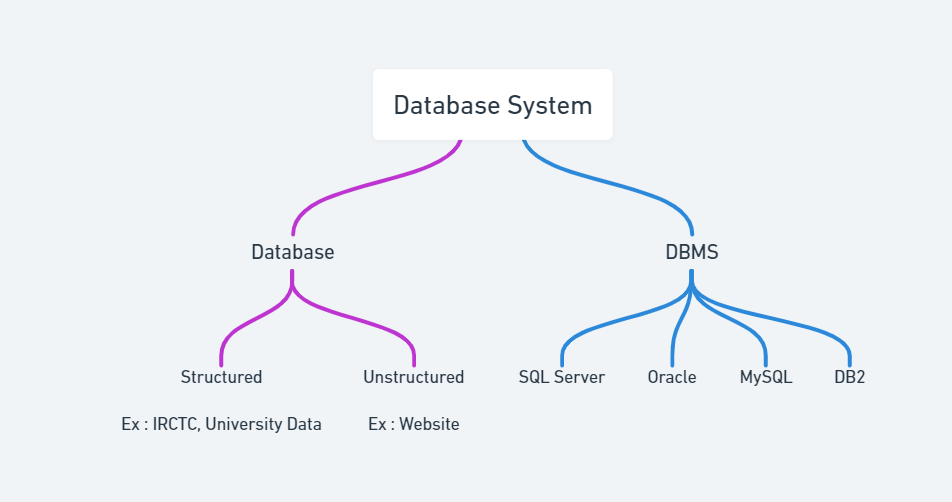

# Overview

- [Overview](#overview)
- [Data : (raw entity)](#data--raw-entity)
- [Information](#information)
- [Database](#database)
- [DBMS](#dbms)
- [DBM](#dbm)
- [DataBase System (DBS)](#database-system-dbs)

&nbsp;

&nbsp;

&nbsp;

# Data : (raw entity)

- Data is the collection of a distinct small unit of info
- Raw facts, figures, statics etc having no particular meaning are data
- Ex : text, image, audio, video, map etc

&nbsp;

# Information

- Meaningful, processed and usable data is called information

&nbsp;

# Database

- Collection of similar or related data

&nbsp;

# DBMS

- DBMS is a software application used to create, manipulate or delete database

- It provides an organized way to interact with databases and ensures data consistency, security, and integrity.

&nbsp;

# DBM

- Inserting, deleting, sorting etc operations are called DBM

&nbsp;

# DataBase System (DBS)

- When we install the software in hardware it's called DBS.

&nbsp;

