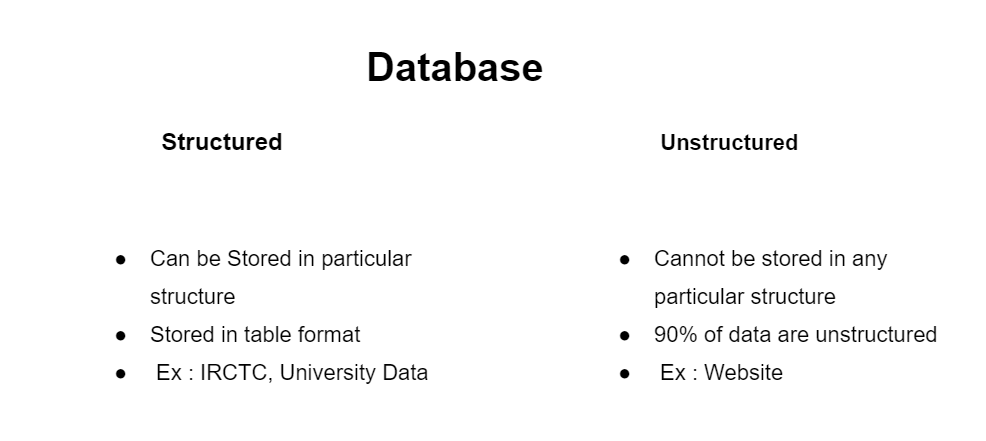

# Overview

- [Overview](#overview)
- [Database](#database)
  - [Purpose of database](#purpose-of-database)
- [Database Management System (DBMS)](#database-management-system-dbms)
- [Types of Database Management System](#types-of-database-management-system)
- [Why Use DBMS?](#why-use-dbms)
- [Comparison Table: RDBMS vs NoSQL vs NewSQL](#comparison-table-rdbms-vs-nosql-vs-newsql)

&nbsp;

&nbsp;

&nbsp;

# Database

- Database is a **collection of similar and organized data** in a format that can be easily accessed.

- It is used to organize data in the form of a **table , schema, view, reports** etc

&nbsp;

&nbsp;

&nbsp;

## Purpose of database

- to create a large amount of information by storing, retrieving and managing data

&nbsp;

N.B. : Database handler creates a database in such a way that only one set of software program will be accessed by the user.

&nbsp;

&nbsp;

# Database Management System (DBMS)

DBMS is a software application used to create, manipulate or delete database

It provides an organized way to interact with databases and ensures data consistency, security, and integrity.

&nbsp;

&nbsp;

# Types of Database Management System

There are two types of Database Management System .

1. Relational Database Management System
2. Non-relational Database Management System

&nbsp;

| Relational Database Management System                    | Non-relational Database Management System                                     |
| -------------------------------------------------------- | ----------------------------------------------------------------------------- |
| Also known as RDBMS                                      | Also known as No-SQL                                                          |
| Data stored in tables                                    | Data not stored in table                                                      |
| Popular RDBMS are : MySQL, SQLServer, Oracle, PostgreSQL |
| MongoDB                                                  |
| Use Cases: Banking, e-commerce, ERP systems              | Use Cases: Big data applications, real-time analytics, social media platforms |
|                                                          |                                                                               |

&nbsp;

&nbsp;

# Why Use DBMS?

DBMS overcomes these issues by offering:

- **Data Organization** – Stores data in a structured format.
- **Data Security** – Provides access control mechanisms.
- **Data Consistency** – Reduces redundancy and maintains integrity.
- **Concurrency Control** – Manages multiple users accessing the database simultaneously.
- **Backup & Recovery** – Prevents data loss in case of failures.
- **Efficient Querying** – Uses SQL and other query languages to retrieve data quickly.

&nbsp;

&nbsp;

# Comparison Table: RDBMS vs NoSQL vs NewSQL

| Feature         | RDBMS                                         | NoSQL                                                                  | NewSQL                              |
| --------------- | --------------------------------------------- | ---------------------------------------------------------------------- | ----------------------------------- |
| Data Model      | Tables (Structured)                           | Key-Value, Document, Column, Graph                                     | Tables (Structured)                 |
| Scalability     | Vertical (Scaling up)                         | Horizontal (Scaling out)                                               | Horizontal (Distributed)            |
| Schema          | Fixed                                         | Flexible                                                               | Fixed                               |
| Consistency     | Strong                                        | Eventual                                                               | Strong                              |
| ACID Compliance | Yes                                           | No (uses BASE: Basically Available, Soft state, Eventually consistent) | Yes                                 |
| Best For        | Traditional applications (e.g., banking, ERP) | Big data, real-time applications                                       | Cloud-native, scalable applications |
|                 |                                               |                                                                        |                                     |

&nbsp;

&nbsp;
