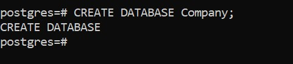
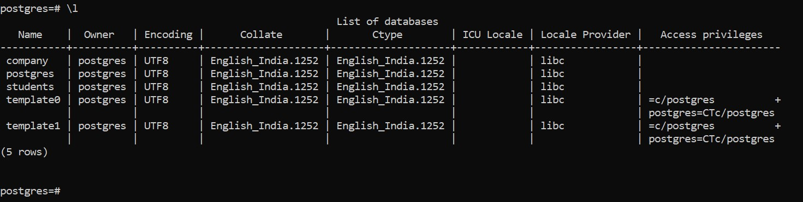

# Database

Database is a **collection of similar and organized data**

&nbsp;

# Create database

```sql
CREATE DATABASE database_name;
```



&nbsp;

# Database list

In SQL shell we can simply type `\l` to see the existent Database



&nbsp;

&nbsp;

# To go to the database

To go to the database in SQL shell, we use `\c database_name`


Here `company` is database name.

&nbsp;
&nbsp;
&nbsp;
&nbsp;
