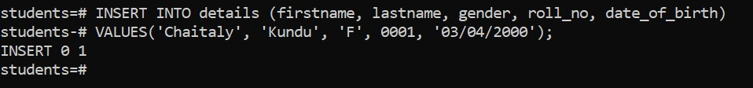
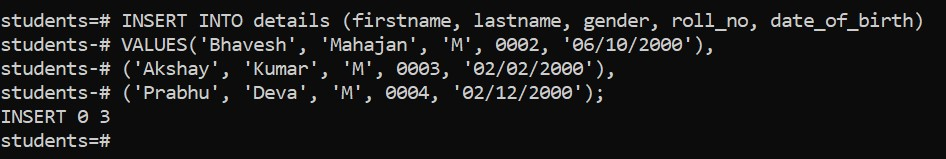
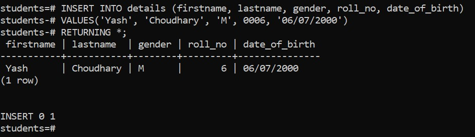
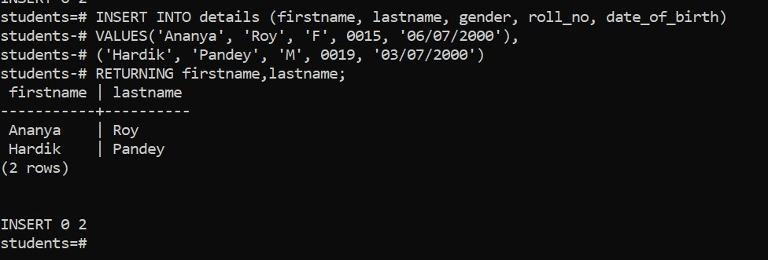
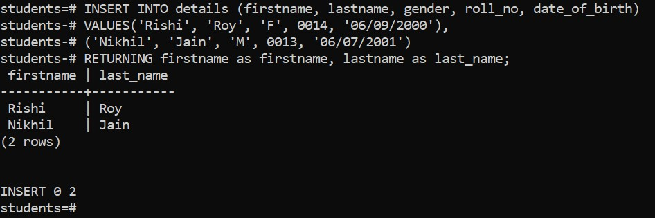

# Overview

- Insert Single Record into table
- Return Value
- Insert Multiple Records into table
- Returning clause

&nbsp;

&nbsp;

&nbsp;

# Insert

`INSERT` statement allows you to insert a new row into a table.

&nbsp;

# Insert Single Record into table

## Syntax

```sql
INSERT INTO table1(column1, column2, …)
VALUES (value1, value2, …);
```

&nbsp;

## Return Value

The `INSERT` statement returns a command tag with the following form:

```sql
INSERT oid count
```

&nbsp;

&nbsp;

# Example

```sql
INSERT INTO details (firstname, lastname, gender, roll_no, date_of_birth)
VALUES('Chaitaly', 'Kundu', 'F', 0001, '03/04/2000');
```

&nbsp;



&nbsp;

&nbsp;

# Insert Multiple Records into table

## Syntax

```sql
INSERT INTO table1(column1, column2, …)
VALUES (value11, value12, …),
(value21, value22, …);

```

&nbsp;

## Example

```sql
INSERT INTO details (firstname, lastname, gender, roll_no, date_of_birth)
VALUES('Bhavesh', 'Mahajan', 'M', 0002, '06/10/2000'),
    ('Akshay', 'Kumar', 'M', 0003, '02/02/2000'),
    ('Prabhu', 'Deva', 'M', 0004, '02/12/2000');
```

&nbsp;



&nbsp;

&nbsp;

# Returning clause

The `INSERT` statement has an optional `RETURNING` clause that returns the information of the inserted row.

&nbsp;

## Return the entire inserted row

If you want to return the entire inserted row, you use an asterisk (\*) after the RETURNING keyword:

```sql
INSERT INTO table1(column1, column2, …)
VALUES (value1, value2, …)
RETURNING *;
```



&nbsp;

&nbsp;

## Return some information

If you want to return **some information** about the inserted row, you can specify one or more columns after the RETURNING clause.

```sql
INSERT INTO table1(column1, column2, …)
VALUES (value1, value2, …)
RETURNING colum1, column2,...;
```

&nbsp;



&nbsp;

&nbsp;

## Rename the returned value

To rename the returned value, you use the AS keyword followed by the name of the output. For example:

```sql
INSERT INTO table1(column1, column2, …)
VALUES (value1, value2, …)
RETURNING output_expression AS output_name;
```

&nbsp;



&nbsp;

&nbsp;

# Insert Dummy data using [Mockaroo](https://www.mockaroo.com/)

Mockaroo allows you to quickly and easily to download large amounts of randomly generated test data based on your own specs which you can then load directly into your test environment using SQL or CSV formats.

&nbsp;

## Steps

1. Go to mockaroo official site : [Mockaroo](https://www.mockaroo.com/)

2. Enter Column name according to your table

3. Change Rows, Format and table name according to necessity

4. Download the file

5. Go to SQL shell > Write command `\i file_path`


&nbsp;
