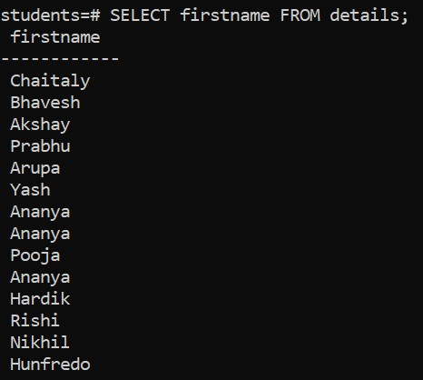
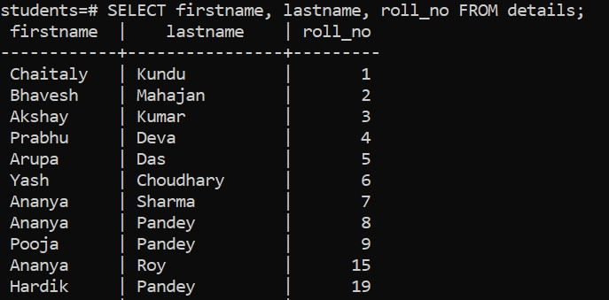
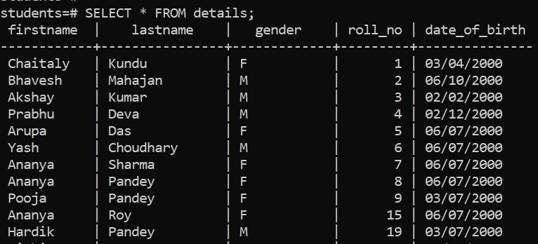

# Overview

- How to fetch data / Select statement
- Syntax
- Clauses

&nbsp;

&nbsp;

&nbsp;

# Select statement

To retrieve data from a data base, we use the `SELECT` statement.

PostgreSQL evaluates the `FROM` clause before the `SELECT` clause.

&nbsp;

# Syntax

### Specify single Column

By specifying the column name, we can choose which columns to select:

```sql
SELECT column_name FROM table_name;
```



&nbsp;

&nbsp;

### Specify multiple Column

```sql
SELECT column_name1, column_name2,.... FROM table_name;
```



&nbsp;

&nbsp;

### Return ALL Columns

Specify a `*` instead of the column names to select all columns:

```sql
SELECT * FROM table_name;
```



&nbsp;

&nbsp;

# Clauses

The `SELECT` statement is one of the most complex statements in PostgreSQL. It has many clauses that you can use to form a flexible query.

The SELECT statement has the following clauses:

- Select distinct rows using `DISTINCT` operator.

- Sort rows using `ORDER BY` clause.

- Filter rows using `WHERE` clause.

- Select a subset of rows from a table using `LIMIT` or `FETCH` clause.

- Group rows into groups using `GROUP BY` clause.

- Filter groups using `HAVING` clause.

- Join with other tables using joins such as `INNER JOIN`, `LEFT JOIN`, `FULL OUTER JOIN`, `CROSS JOIN` clauses.

- Perform set operations using `UNION`, `INTERSECT`, and `EXCEPT`.

&nbsp;

&nbsp;

&nbsp;
&nbsp;

&nbsp;
&nbsp;

&nbsp;
