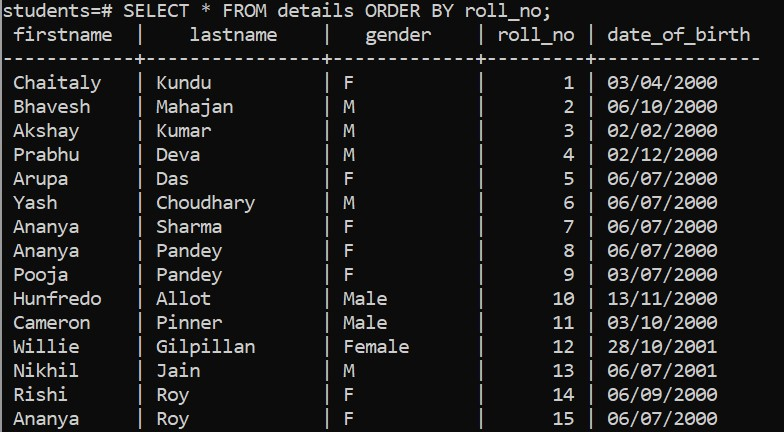
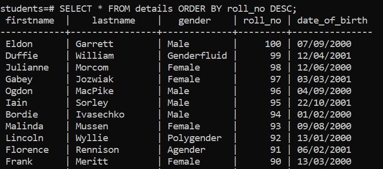
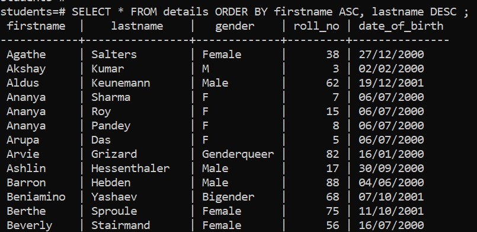

# Overview

- how to use the PostgreSQL ORDER BY
- Sort rows by one column in ascending order
- Sort rows by one column in descending order
- Sort rows by multiple columns
- Evaluation

&nbsp;

&nbsp;

&nbsp;

# PostgreSQL ORDER BY

When you query data from a table, the `SELECT` statement returns rows in an unspecified order. To sort the rows of the result set, you use the `ORDER BY` clause in the `SELECT` statement.

The `ORDER BY` clause allows you to sort rows returned by a `SELECT` clause in ascending or descending order based on a sort expression.

&nbsp;

&nbsp;

# 1. Sort rows by one column in ascending order

## Syntax

```sql
SELECT column_list FROM table_name ORDER BY sort_expression;

-- or

SELECT column_list FROM table_name ORDER BY sort_expression1 ASC;
```

&nbsp;

&nbsp;

## Example

```sql
SELECT * FROM details ORDER BY roll_no;

-- or

SELECT * FROM details ORDER BY roll_no ASC;
```

By default this will be sorted by ascending order.



&nbsp;

&nbsp;

# 2. Sort rows by one column in descending order

## Syntax

```sql
SELECT column_list FROM table_name ORDER BY sort_expression DESC;
```

&nbsp;

&nbsp;

## Example

```sql
SELECT * FROM details ORDER BY roll_no DESC;
```



&nbsp;

&nbsp;

# 3. Sort rows by multiple columns

## Syntax

```sql
SELECT column_list FROM table_name 
ORDER BY 
    sort_expression1 [ASC|DESC], 
    sort_expression2 [ASC|DESC];
```

&nbsp;

&nbsp;

## Example

```sql
SELECT * FROM details ORDER BY firstname ASC, lastname DESC;
```



&nbsp;

&nbsp;

# Evaluation

PostgreSQL evaluates the clauses in the `SELECT` statement in the following order: `FROM`, `SELECT`, and `ORDER BY`:

> FROM > SELECT > ORDER BY

&nbsp;

&nbsp;
&nbsp;

&nbsp;
