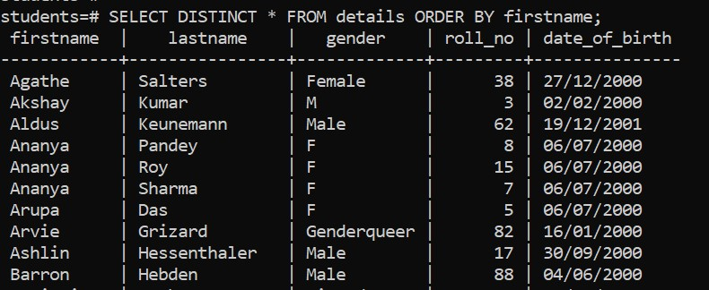
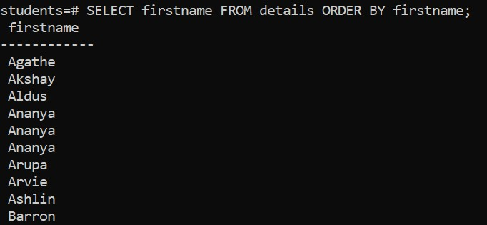
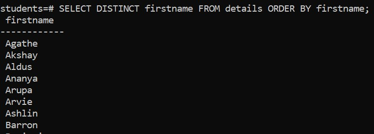
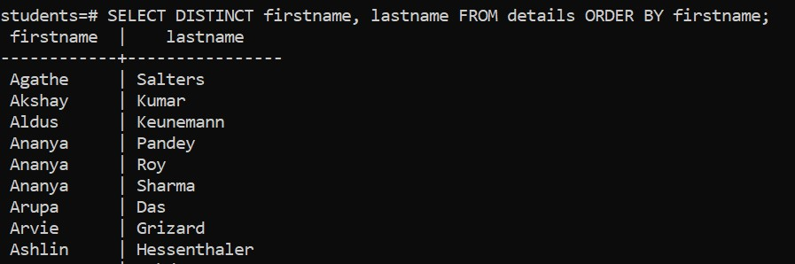

# Overview

- how to use the PostgreSQL SELECT DISTINCT clause
- Find distinct values of all columns
- Find distinct values of one column
- Find distinct values of multiple columns
- Evaluation

&nbsp;

&nbsp;

&nbsp;

# SELECT DISTINCT

The `SELECT DISTINCT` removes duplicate rows from a result set.

The `SELECT DISTINCT` clause retains one row for each group of duplicates.

We use the `SELECT DISTINCT` clause to analyze the **uniqueness** of values in a column.

The `SELECT DISTINCT` clause can be applied to one or more columns in the select list of the `SELECT` statement.

&nbsp;

&nbsp;

# 1. Find distinct values of all columns

If you want to find distinct values of all columns in a table, you can use `SELECT DISTINCT *`

## Syntax

```sql
SELECT DISTINCT * FROM table_name;
```

&nbsp;

&nbsp;

## Example

```sql
SELECT DISTINCT * FROM details ORDER BY firstname;
-- here ORDER BY is optional
```



&nbsp;

&nbsp;

# 2. Find distinct values of one column

## Syntax

```sql
SELECT DISTINCT * FROM table_name;
```

&nbsp;

&nbsp;

## Example

```sql
SELECT DISTINCT firstname FROM details ORDER BY firstname;
```

&nbsp;

Here without `DISTINCT` we can get the following values for `firstname` column



&nbsp;

And if we use `DISTINCT` we can get the following values for `firstname` column



&nbsp;

&nbsp;

# 2. Find distinct values of multiple columns

## Syntax

```sql
SELECT DISTINCT col_name1, col_name2,.. FROM table_name;
```

&nbsp;

&nbsp;

## Example

```sql
SELECT DISTINCT firstname, lastname FROM details ORDER BY firstname;
```



&nbsp;
