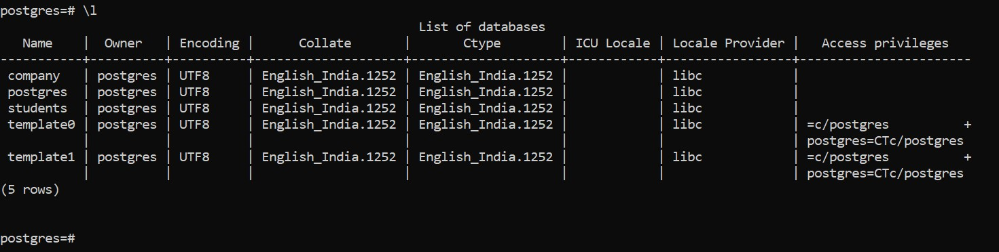

# Overview

- What is Database
- How to Create database
- How to check Database list
- How to go to particular database

&nbsp;

&nbsp;

&nbsp;

# Database

Database is a **collection of similar and organized data**

&nbsp;

&nbsp;

# Create database

## Syntax

```sql
CREATE DATABASE database_name;
```

&nbsp;

## Example

```sql
CREATE DATABASE Company;
```


&nbsp;

&nbsp;

# Database list

In SQL shell we can simply type `\l` to see the existent Database

## Syntax

```sql
\l
```



&nbsp;

&nbsp;

# Go to particular database

To go to the database in SQL shell, we use `\c database_name`

## Syntax

```sql
\c database_name
```

&nbsp;

## Example

```sql
\c company
```


Here `company` is the database name.

&nbsp;
&nbsp;
&nbsp;
&nbsp;
