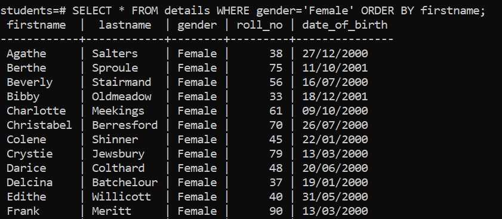

# Overview

- how to use the PostgreSQL WHERE clause
- Evaluation
- Syntax
- Operators

&nbsp;

&nbsp;

&nbsp;

# WHERE clause

The `SELECT` statement returns all rows from one or more columns in a table. To retrieve rows that satisfy a specified condition, you use a `WHERE` clause.

The WHERE clause uses the condition to filter the rows returned from the `SELECT` clause.

The condition is a **boolean expression** that evaluates to true, false, or unknown.

The query returns only rows that satisfy the condition in the `WHERE` clause. In other words, the query will include only rows that cause the condition evaluates to true in the result set.

Besides the SELECT statement, you can use the WHERE clause in the `UPDATE` and `DELETE` statement to specify rows to update and delete.

&nbsp;

&nbsp;

# Evaluation

PostgreSQL evaluates the `WHERE` clause after the `FROM` clause but before the `SELECT` and `ORDER BY` clause:

> FROM > WHERE > SELECT > ORDER BY

&nbsp;

&nbsp;

# Syntax

```sql
SELECT
  select_list
FROM
  table_name
WHERE
  condition
ORDER BY
  sort_expression;
```

&nbsp;

&nbsp;

# Example

```sql
SELECT * FROM details WHERE gender='Female' ORDER BY firstname;
```

ORDER BY is optional is order clause.


&nbsp;

&nbsp;

# Operator

To form the condition in the WHERE clause, you use comparison and logical operators:

| Operator | Description                                         |
| -------- | --------------------------------------------------- |
| =        | Equal                                               |
| >        | Greater than                                        |
| <        | Less than                                           |
| >=       | Greater than or equal                               |
| <=       | Less than or equal                                  |
| <>        or !=| Not equal                                     |
| AND      | Logical operator AND                                |
| OR       | Logical operator OR                                 |
| IN       | Return true if a value matches any value in a list  |
| BETWEEN  | Return true if a value is between a range of values |
| LIKE     | Return true if a value matches a pattern            |
| IS NULL  | Return true if a value is NULL                      |
| NOT      | Negate the result of other operators                |
|||

&nbsp;

&nbsp;

