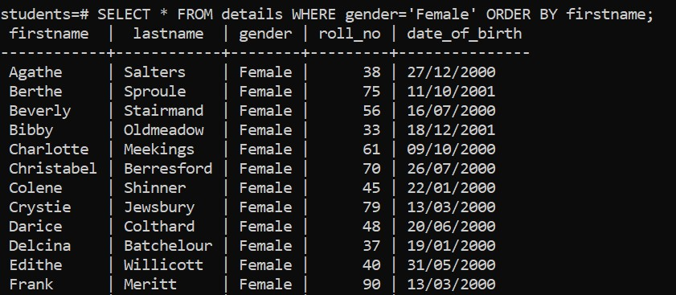

# Overview

- Using WHERE clause with the equal (=) operator example

&nbsp;

&nbsp;

&nbsp;

# Syntax

```sql
SELECT
  select_list
FROM
  table_name
WHERE
  col_name = condition
ORDER BY
  sort_expression;
```

&nbsp;

&nbsp;

# Example

```sql
SELECT * FROM details WHERE gender='Female' ORDER BY firstname;
```



&nbsp;

&nbsp;
