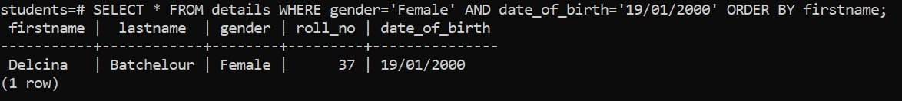

# Overview

- Using WHERE clause with the AND operator

&nbsp;

&nbsp;

&nbsp;

# Introduction
We use AND clause when we need to check two or more conditions.
`

# Syntax

```sql
SELECT
  select_list
FROM
  table_name
WHERE
  condition AND condition
ORDER BY
  sort_expression;
```

&nbsp;

&nbsp;

# Example

```sql
SELECT * FROM details WHERE gender='Female' AND date_of_birth='19/01/2000' ORDER BY firstname;
```



&nbsp;

&nbsp;
