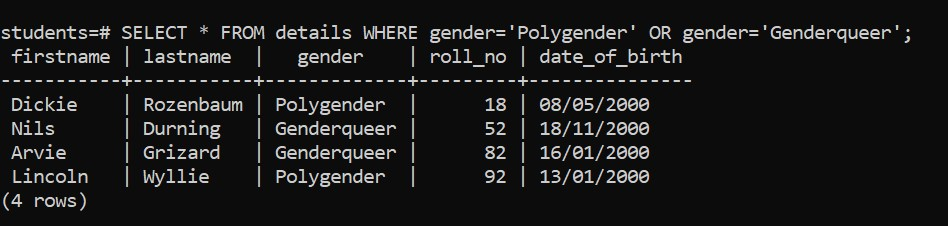
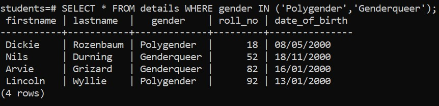

# Overview

- Using WHERE clause with the IN operator
- How can we express OR operator to In

&nbsp;

&nbsp;

&nbsp;

# Introduction

If you want to find a value in a list of values, you can use the `IN` operator.

# Syntax

```sql
SELECT
  select_list
FROM
  table_name
WHERE
  col_name IN ('value1','value2'.....)
ORDER BY
  sort_expression;
```

&nbsp;

&nbsp;

# Change OR operator to IN

```sql
SELECT * FROM details WHERE gender='Polygender' OR gender='Genderqueer';
```

This is `OR` operator. We can express this `OR` operator using `IN`.

```sql
SELECT * FROM details WHERE gender IN ('Polygender','Genderqueer');
```

&nbsp;



&nbsp;


