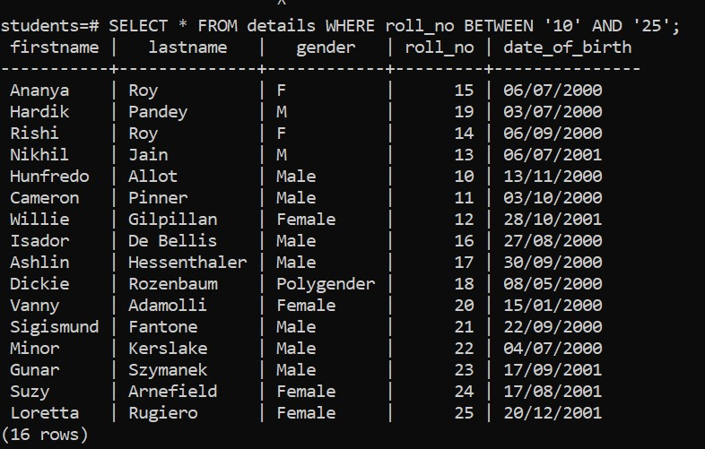

# Overview

- Using WHERE clause with the IN operator

&nbsp;

&nbsp;

&nbsp;

# Introduction

The `BETWEEN` operator returns true if a value is in a range of values.

&nbsp;

&nbsp;

# Syntax

```sql
SELECT
  select_list
FROM
  table_name
WHERE
  col_name BETWEEN '__value__' AND '__value__'
ORDER BY
  sort_expression;
```

&nbsp;

&nbsp;

# Example

```sql
SELECT * FROM details WHERE roll_no BETWEEN '10' AND '25';
```



&nbsp;

&nbsp;
