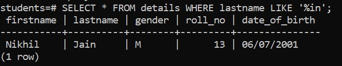
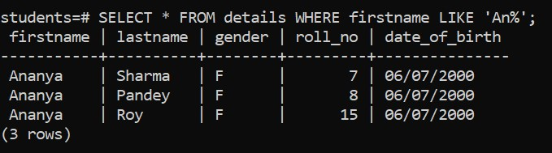
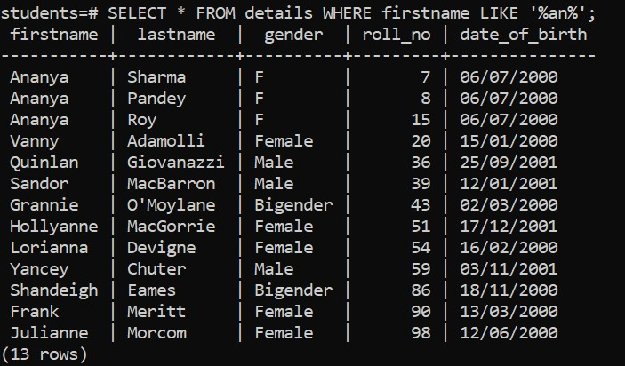
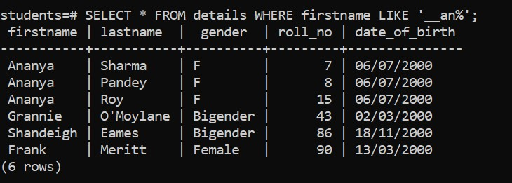
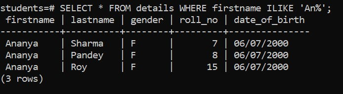
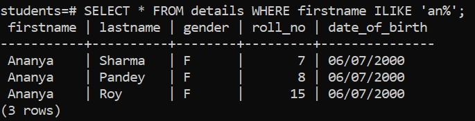

# Overview

- Using WHERE clause with the Like operator
- How can we express OR operator to In

&nbsp;

&nbsp;

&nbsp;

# Introduction

To find a string that matches a specified pattern, you use the `LIKE` operator.

The`%` is called a **_wildcard_** that matches any string.

&nbsp;

&nbsp;

# Using LIKE '%value'

## Syntax

The `'%in'` pattern matches any strings that ends with 'in'.

```sql
SELECT select_list
FROM table_name
WHERE
  col_name LIKE '%value';
```

&nbsp;

## Example

```sql
SELECT * FROM details WHERE lastname LIKE '%in';
```



&nbsp;

&nbsp;

# Using LIKE 'value%'

## Syntax

```sql
SELECT select_list
FROM table_name
WHERE
  col_name LIKE 'value%';
```

&nbsp;

## Example

The `'An%'` pattern matches any strings that starts with 'An'.

```sql
SELECT * FROM details WHERE firstname LIKE 'An%';
```

The 'An%' pattern matches any strings that starts with 'An'.



&nbsp;

&nbsp;

# Using LIKE '%value%'

## Syntax

```sql
SELECT select_list
FROM table_name
WHERE
  col_name LIKE '%value%';
```

&nbsp;

## Example

The '%an%' pattern matches any strings that in which'an' will be in the middle.

```sql
SELECT * FROM details WHERE firstname LIKE '%an%';
```



&nbsp;

&nbsp;

# Using LIKE '\_value%'

`LIKE` is case sensitive

## Syntax

```sql
SELECT select_list
FROM table_name
WHERE
  col_name LIKE '_value%';
```

Note : `_` means number of alphabets before targeted values.

&nbsp;

## Example

The '\_\_an%' pattern matches any strings that in which two alphabets will be there before 'an'.

```sql
SELECT * FROM details WHERE firstname LIKE '__an%';
```



&nbsp;

&nbsp;

# Using ILIKE `value%`

The `ILIKE` operator is a PostgreSQL extension that works exactly like the `LIKE` operator, except that it is case insensitive.

&nbsp;

The following both are same.

```sql
SELECT * FROM details WHERE firstname ILIKE 'An%';
```



&nbsp;

```sql
SELECT * FROM details WHERE firstname ILIKE 'an%';
```


