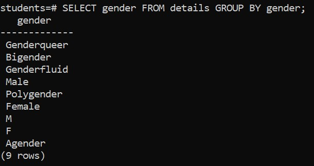

# GROUP BY without an aggregate function

The `GROUP BY` clause removes duplicate values in the column and returns distinct values

## Synrax

```sql
SELECT 
   column_1, 
   column_2,
   ...
FROM 
   table_name
GROUP BY 
   column_1,
   column_2,
   ...;
```

&nbsp;

## Example

```sql
SELECT gender FROM details GROUP BY gender;
```

 In this example, the GROUP BY clause works like the `DISTINCT` operator.



&nbsp;

&nbsp;
