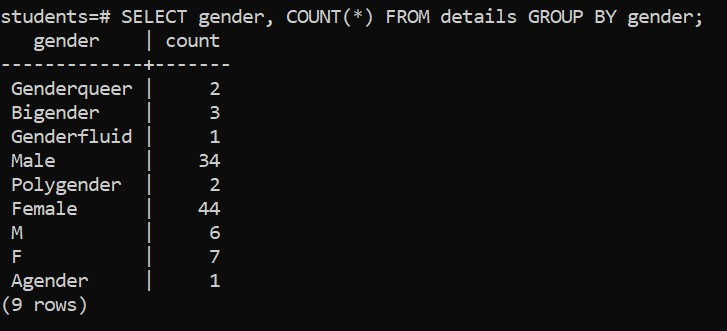

# GROUP BY with COUNT() function

# Syntax

```sql
SELECT
  column_name,
  COUNT (*)
FROM
  table_name
GROUP BY
  column_name;
```

&nbsp;

&nbsp;

# Example

The following example uses the `GROUP BY` clause with the `COUNT()` function to count the number of students for the specific gender:

&nbsp;

```sql
SELECT gender, COUNT(*) FROM details GROUP BY gender;
```

&nbsp;



&nbsp;

&nbsp;

&nbsp;

&nbsp;
