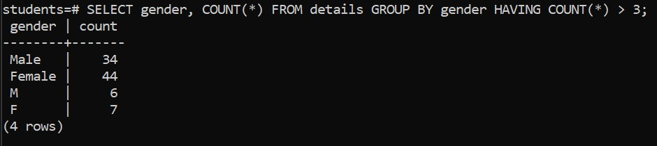

# Overview

- how to use the PostgreSQL GROUP BY .... HAVING clause
- Evaluation
- Syntax
- Example

&nbsp;

&nbsp;

&nbsp;

# GROUP BY .......... HAVING clause

The `HAVING` clause specifies a search condition for a group.

The `HAVING` clause is often used with the `GROUP BY` clause to filter groups based on a specified condition after perform the aggregation

&nbsp;

&nbsp;

# Evaluation

PostgreSQL evaluates the HAVING clause after the FROM, WHERE, GROUP BY, and before the DISTINCT, SELECT, ORDER BY and LIMIT clauses:

> FROM > WHERE > GROUP BY > HAVING > DISTINCT >SELECT > ORDER BY > LIMIT

&nbsp;

&nbsp;

# Syntax

```sql
SELECT
  column1,
  aggregate_function (column2)
FROM
  table_name
GROUP BY
  column1
HAVING
  condition;
```

&nbsp;

&nbsp;

# Example

```sql
SELECT gender, COUNT(*) FROM details GROUP BY gender HAVING COUNT(*) > 5;
```

&nbsp;



&nbsp;

&nbsp;

&nbsp;
