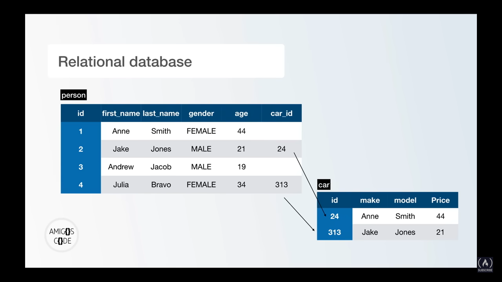

# Relational Database

Relational Database is the relation between two or more tables.

&nbsp;

In the following image there is a relation between **person** table & **car** table

&nbsp;

&nbsp;

# RDBMS

RDBMS stands for Relational Database Management System.

RDBMS is the basis for SQL, and for all modern database systems such as MS SQL Server, IBM DB2, Oracle, MySQL, and Microsoft Access.

The data in RDBMS is stored in database objects called tables. A table is a collection of related data entries and it consists of columns and rows.

&nbsp;

&nbsp;

&nbsp;

&nbsp;

&nbsp;
